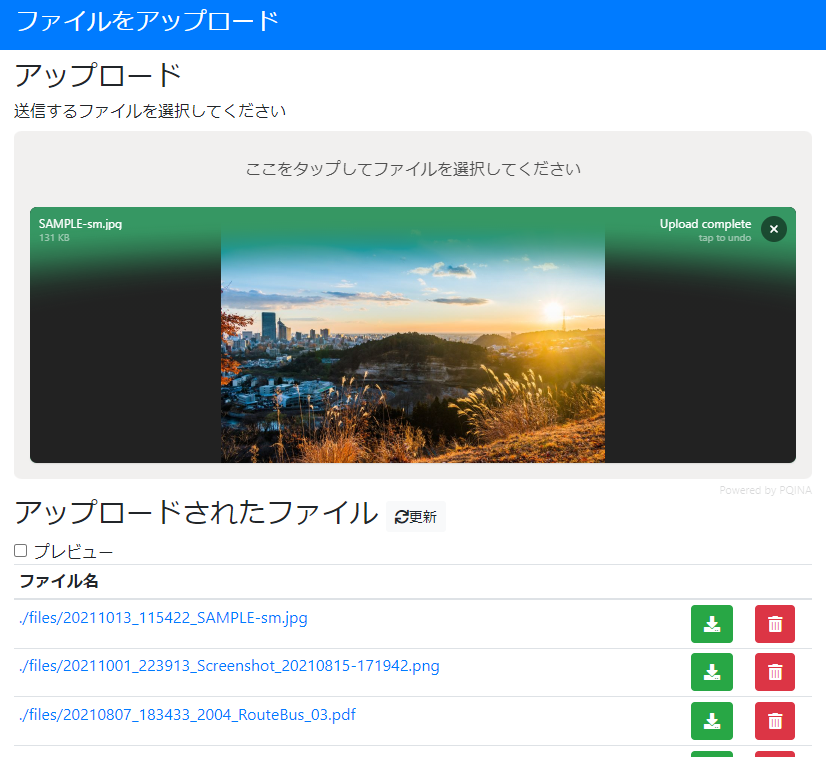
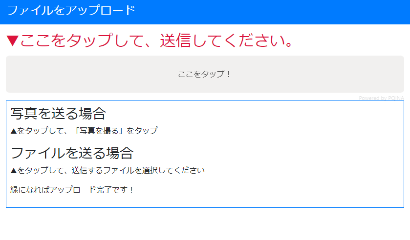

# file-uploader

PHP＋Vue.js製のファイルアップロードサイトです。

Webサーバーにアップロードするだけで使えますので、レポートの提出や他人からのファイルの受け取りに活用できます。

## 特徴

会社や大学のサーバーに設置することで、お手軽にファイルアップローダーを設置することができます。

アップロード専用ページも用意しています。

どんな種類のファイルでも送信することができます。PDF、Officeをはじめ、写真や動画も送れます。

送信されたファイルはfilesディレクトリに保存され、管理ページから参照することができます。

APIとフロントエンドは完全に分割して開発しています。APIとの通信はJSONを基本としているので、カスタマイズしやすい作りになっています。

コードは必要最低限となっているため、目的に応じてカスタマイズしてください。

## 動作環境

- Apache・Nginx
- PHP

ライブラリにFilePondを使用しています。

https://pqina.nl/filepond/

